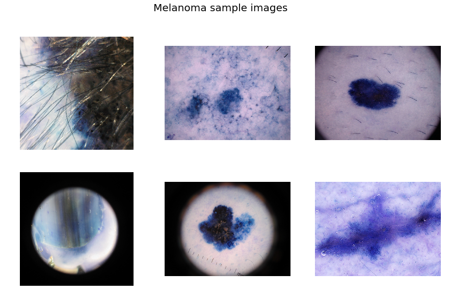
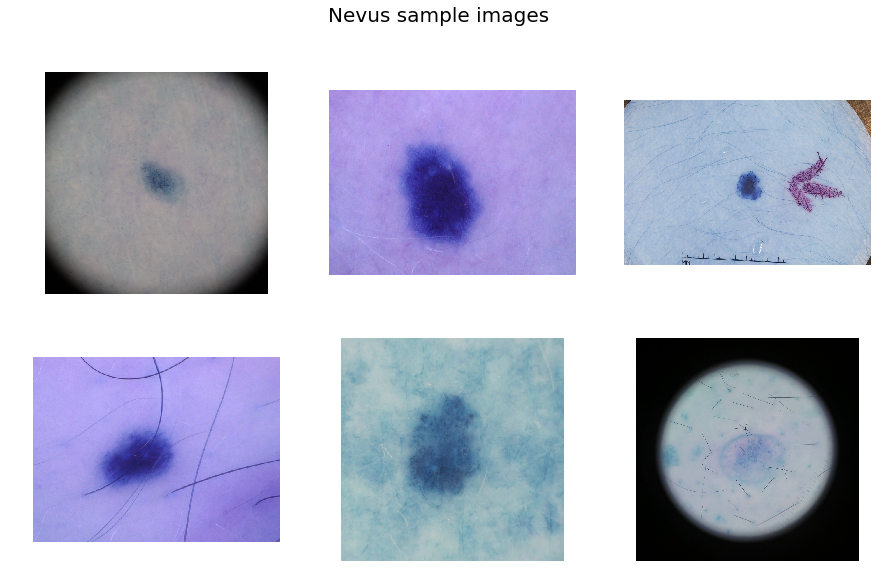
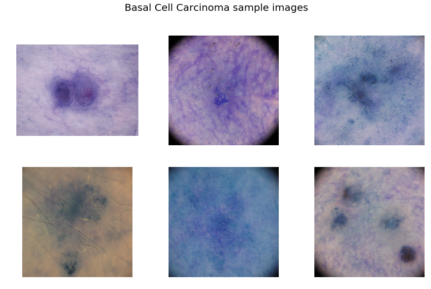

# README

This file contains all the information about the skin cancer detection project that was developed. 

## Overview: 
This project uses a deep learning model to classify skin cancer types (Basal Cell Carcinoma, Melanoma, Nevus). The model is trained on a dataset containing images of skin lesions. Users can upload a picture, and the model will predict the type of skin cancer.

## Dataset
<pre>
The following dataset has been used to develop the model:
  
Dataset : <a href=https://challenge.isic-archive.com/data/>ISIC Skin Cancer Challenge 2019</a>

<b>Dataset Details</b>
Dataset Name            : ISIC Skin Cancer Images 
Number of Class         : 3 (Basal Cell Carcinoma vs Melanoma vs Nevus)
Number/Size of Images   : Total      : 12, 445
                          Training   : 12, 295
                          Testing    : 150 </pre>
## Sample Images

Sample images from the dataset:

1. Melanoma:



2. Nevus:



3. Basal-cell carcinoma:



## Tech Used 

**Language:** Python (3.10)

**Front-End:** Streamlit

## Table of Contents
- [Requirements](#requirements)
- [Features](#features)
- [Installation](#installation)
- [Usage](#usage)
- [References](#reference)

## Requirements
```bash
numpy
pandas
seaborn
tensorflow
scikit-learn
matplotlib
itertools
PIL 
random
cv2         
streamlit
```

## Features

- Upload an image for skin cancer classification.
- Predict the type of skin cancer: Basal Cell Carcinoma, Melanoma, Nevus.
- User-friendly interface light weight interface. 

## Installation

Please install and configure the latest version of Python before using this application. 

` cd <Path to your chosen drive>` 

`pip install [required library name]`

## Usage
- streamlit run app.py
- Open your web browser and go to http://localhost: (local server address).

## References

Many references and guides have been used for developing the code for this project.  

1. Tensorflow Documentation: https://www.tensorflow.org/api_docs/python/tf

2. Keras Documentation : https://keras.io/guides/sequential_model/, https://keras.io/api/applications/mobilenet/

3. Scikit Learn Documentation: https://scikit-learn.org/stable/modules/neural_networks_supervised.html#classification

4. DataCamp: https://www.datacamp.com/tutorial/convolutional-neural-networks-python

5. GeeksforGeeks: https://www.geeksforgeeks.org/image-classifier-using-cnn/

6. Towards Data Science: https://towardsdatascience.com/


## Acknowledgements

- We appreciate the contributions of the open-source machine learning community and the help and references received from platforms such as Stack Overflow, Kaggle, Stack Exchange, etc. in resolving many errors and bugs. 
